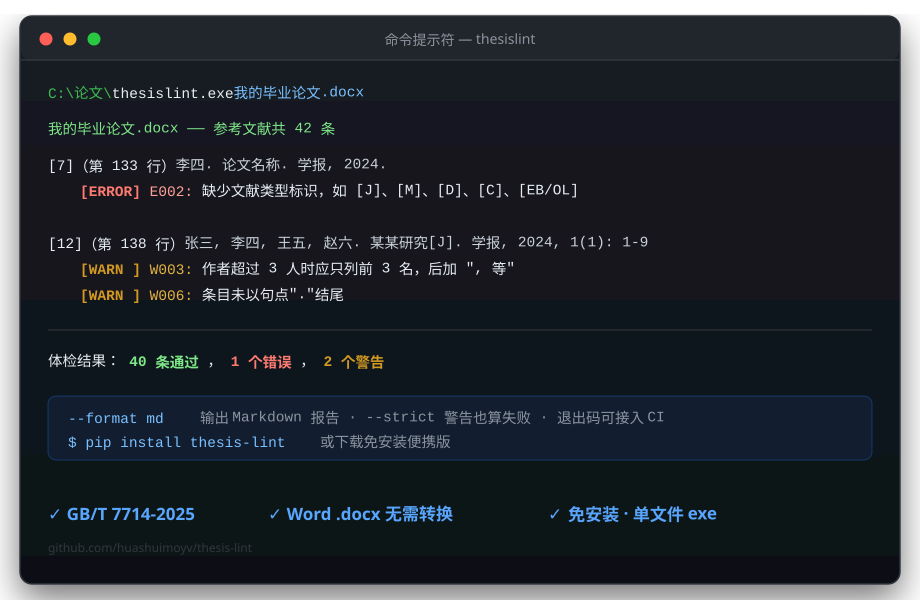
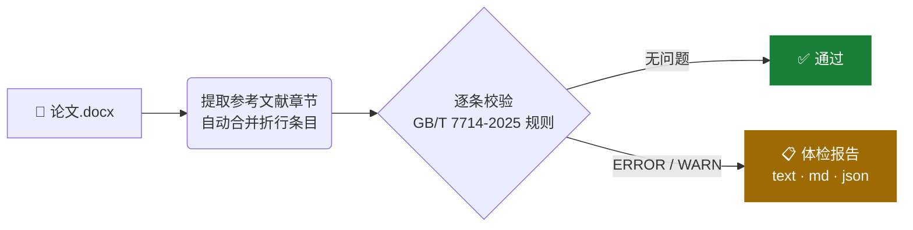

<div align="center">

# 🎓 thesis-lint

_毕业论文「国标体检」工具_

**让每一篇 Word 论文的参考文献，都经得起 GB/T 7714-2025 的检验**

[](https://github.com/huashuimoyv/thesis-lint/releases)
[](./actions)
[](./LICENSE)
[](pyproject.toml)



**[🌐 在线版（免下载，浏览器直接用）](https://huashuimoyv.github.io/thesis-lint/)**
·
[⬇️ 下载免安装便携版](https://github.com/huashuimoyv/thesis-lint/releases/latest)
·
[快速上手](#-快速上手)
·
[规则总览](#-规则总览)
·
[参与贡献](#-参与贡献)

</div>

---

## 🤔 为什么需要它

> 现有的国标格式工具几乎全是给 **LaTeX 用户**的——而大多数中国毕业生用 **Word** 写论文，
> 只能对照模板肉眼逐条检查，交稿后被导师圈出十几处标点错误。

| | 肉眼检查 | 🔬 thesis-lint |
|---|---|---|
| 检查 40 条参考文献耗时 | 30 分钟起，还容易漏 | **3 秒，一条不落** |
| 全角标点、缺句点这类隐形问题 | 全靠眼力 | ✅ 自动识别 |
| 作者 "等"/"et al." 缩略规则 | 很多人不知道有这规定 | ✅ 给出国标条款 |
| 结果可复现 | 看一遍忘一遍 | 报告可存档、可进 CI |

## ⚙️ 工作原理



## 🚀 快速上手

<details open>
<summary><b>方式〇：在线版（零安装，推荐先试试）</b></summary>

打开 **[huashuimoyv.github.io/thesis-lint](https://huashuimoyv.github.io/thesis-lint/)**，
把论文拖进网页即可。文档在你的浏览器本地解析（WebAssembly），**不会上传到任何服务器**。
首次打开需加载约 15 MB 引擎，之后浏览器缓存秒开。

</details>

<details>
<summary><b>方式一：便携版（Windows 桌面，黑白双主题）</b></summary>

1. 从 [Releases](https://github.com/huashuimoyv/thesis-lint/releases/latest) 下载 `thesis-lint-vX.Y.Z-windows-x64-portable.zip`
2. 解压后**双击 `thesislint.exe`**：拖入论文（或点击选择、直接拖到 exe 图标）自动体检
3. 报告显示在窗口里，可按错误/警告筛选，并支持**生成修正后列表**、复制/导出
4. 高级用法：命令行带参数 `thesislint.exe 论文.docx --format md` 等，行为与 pip 安装版一致

修正列表以当前检查报告为准，不会修改原文档。如果检查后又在 Word 中编辑了论文，请重新检查后再生成修正列表。

</details>

<details>
<summary><b>方式二：pip 安装（需要 Python 3.10+）</b></summary>

```bash
pip install thesis-lint   # 发布 PyPI 后可用；当前可从源码安装：
pip install git+https://github.com/huashuimoyv/thesis-lint.git
```

```bash
thesislint 论文.docx                # 文本报告（默认）
thesislint 论文.docx --format md    # Markdown 报告，适合贴进 issue / PR
thesislint 论文.docx --format json  # JSON，方便接入其他工具
thesislint 论文.docx --strict       # CI 中使用：有警告也算失败
```

退出码：`0` 完成检查且无错误 · `1` 有错误 · `2` 文件/用法问题或没有可检查的参考文献 —— 可直接作为提交前检查。

</details>

## 🩺 规则总览

支持正文段落与 Word 表格中的参考文献，并按文档顺序检查。表格每一行的多列内容会合并成一条文献；同一段落或单元格内换行后以 `[n]` 开头时按新条目检查，普通折行仍合并到上一条。
如果没有找到参考文献章节，或章节内没有可提取的文本，工具会明确提示“未完成检查”，不会把 0 条文献显示为通过。

| 级别 | 规则 | 示例 |
|:---:|------|------|
| ❌ ERROR | 缺少序号 `[n]` | 条目必须以 `[1]` 开头 |
| ❌ ERROR | 缺少文献类型标识 `[J]` `[M]` `[D]` … | 李四. 论文名称<span>.</span> 学报… ← 缺标识 |
| ❌ ERROR | 电子资源（`/OL`）缺少获取路径 | 必须附网址 |
| ❌ ERROR | 缺少出版年份 | 需含 4 位年份或完整日期 |
| ❌ ERROR | 序号重复 | 两个 `[3]` |
| ⚠️ WARN | 西文作者未“姓前名缩写” | ~~Smith John~~ → `SMITH J` |
| ⚠️ WARN | 作者超 3 人未加 “, 等” | 国标第 8.1.2 条 |
| ⚠️ WARN | 使用全角标点（，。；：） | ~~计算机学报，2024~~ → `学报, 2024` |
| ⚠️ WARN | 条目未以句点结尾 | 结尾须为 `.` |
| ⚠️ WARN | 电子资源缺引用日期 `[YYYY-MM-DD]` | `/OL` 类型建议标注 |
| ⚠️ WARN | 序号跳号 | `[1]` 后直接 `[3]` |
| ⚠️ WARN | 页码区间异常 | `110-100`、`100～110` |
| ⚠️ WARN | 已出现但格式不完整的 DOI | `doi: 10.12/abc` |
| ⚠️ WARN | 纸质专著出版项不完整 | 未识别到“出版地: 出版者, 年份” |

不会强制要求每条文献都有 DOI 或页码；电子文章号（如 `e10345`）不会按页码误报。报告中的“规则依据”入口会打开国家标准官方信息页，最终格式仍以学校要求为准。

## 🗺 Roadmap

- [x] 页码区间、纸质专著出版项与 DOI 格式提示
- [ ] 正文引用 `[1][2]` 与文献表交叉核对
- [ ] 图表编号连续性、公式编号检查
- [ ] 学校规则预设包（见下）
- [ ] GitHub Action：在 PR 里自动评论论文体检报告

## 💡 让你的学校被第一个支持

Roadmap 中的「学校规则预设包」会为每所学校维护一份检查配置。
如果你希望 `rules/<你的学校>.json` 尽快出现：

- 提 [issue](https://github.com/huashuimoyv/thesis-lint/issues) 并附上学校的论文格式要求文档
- **不想折腾 GitHub？直接发邮件也行**：`1416922533@qq.com`，
  主题写「学校名 + 论文格式要求」，附上格式文档（拍照/截图/PDF 都可以），我们看到就会排期收录

## 🤝 参与贡献

规则集还不够全——这正是社区最能出力的地方。发现误报/漏报时，
欢迎提 issue 并附上出错条目原文；提交新规则请附带对应测试用例。

同样地，**不熟悉 GitHub 的同学直接发邮件到 `1416922533@qq.com` 反馈即可**，
描述清楚「哪条参考文献 · 报告说了什么 · 实际应该是什么」，就是最有价值的反馈。

```bash
git clone https://github.com/huashuimoyv/thesis-lint.git
cd thesis-lint
pip install -e ".[dev]"
pytest          # 运行回归测试（真实桌面测试默认跳过）
```

在具备 Tk 桌面环境的 Windows 上，可额外检查黑白主题的打开、检查、修正和导出流程：

```powershell
$env:THESISLINT_RUN_GUI_TESTS = "1"
pytest tests/test_gui_live.py --no-cov
```

欢迎任何形式的贡献：新规则、Bug 反馈、文档改进、把它推荐给你的同学 😊

## 📄 License

[MIT](./LICENSE) © huashuimoyv
